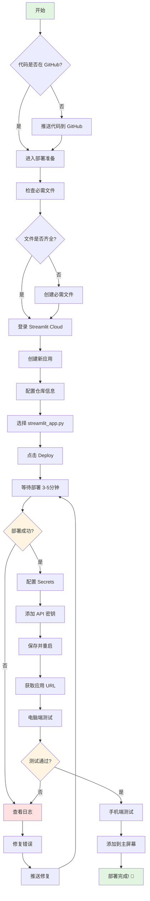
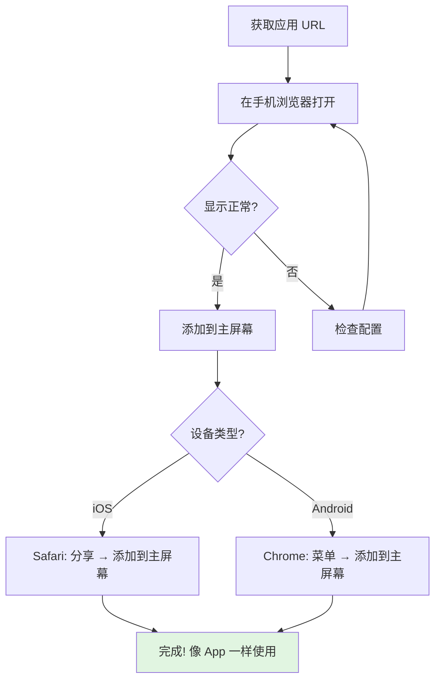

# 🚀 Streamlit Cloud 快速部署流程图

## 📊 部署流程可视化



## 🎯 关键步骤时间估算

| 步骤 | 预计时间 | 说明 |
|------|----------|------|
| 1. 准备文件 | ✅ 已完成 | 所有文件已自动生成 |
| 2. 推送到 GitHub | 1-2 分钟 | 执行 git 命令 |
| 3. 创建应用 | 1 分钟 | 在 Streamlit Cloud 配置 |
| 4. 部署等待 | 3-5 分钟 | 安装依赖和启动 |
| 5. 配置密钥 | 2-3 分钟 | 复制粘贴 API 密钥 |
| 6. 测试访问 | 1 分钟 | 验证功能 |
| **总计** | **约 10 分钟** | 首次部署 |

## 🔄 更新流程（第二次之后）


**⚡ 更新只需 2-3 分钟！**

## 📱 移动端访问流程



## 🎬 分步骤详细说明

### 第 1 步: 推送代码到 GitHub (1-2分钟)

```bash
# 在项目根目录执行
git add .
git commit -m "添加 Streamlit Cloud 部署配置"
git push origin main
```

**检查点**: 
- ✅ GitHub 仓库显示最新提交
- ✅ 包含 `streamlit_app.py` 文件

---

### 第 2 步: 登录 Streamlit Cloud (1分钟)

1. 访问: https://share.streamlit.io/
2. 点击 "Continue with GitHub"
3. 授权访问你的仓库

**检查点**:
- ✅ 看到 "New app" 按钮
- ✅ 可以选择你的仓库

---

### 第 3 步: 创建应用 (1分钟)

填写表单：
```
Repository: 你的GitHub用户名/TradingAgents-CN
Branch: main
Main file path: streamlit_app.py
```

点击 **Deploy!**

**检查点**:
- ✅ 看到部署进度条
- ✅ 日志开始滚动

---

### 第 4 步: 等待部署 (3-5分钟)

观察日志输出：
```
Cloning repository...         ✅
Installing dependencies...    ⏳ (最耗时)
Starting application...       ✅
```

**常见日志信息**:
- `Collecting packages...` - 正常，耐心等待
- `Building wheels...` - 正常，编译依赖
- `Successfully installed...` - 完成！

---

### 第 5 步: 配置 API 密钥 (2-3分钟)

1. 点击 **Manage app** → **Settings** → **Secrets**

2. 复制以下模板并填入真实密钥：

```toml
[llm]
OPENAI_API_KEY = "sk-你的密钥"

[data_sources]
TUSHARE_TOKEN = "你的token"
```

3. 点击 **Save**

**检查点**:
- ✅ Secrets 已保存
- ✅ 应用自动重启（约30秒）

---

### 第 6 步: 测试访问 (1分钟)

1. **桌面端**: 在浏览器打开应用 URL
2. **移动端**: 在手机浏览器输入相同 URL

**功能测试**:
- [ ] 页面正常加载
- [ ] 可以输入股票代码
- [ ] 可以选择分析选项
- [ ] 可以提交分析

---

## 🚨 常见错误快速修复

### Error: "ModuleNotFoundError"

**原因**: 缺少依赖包

**解决**:
```bash
# 确认 requirements.txt 或 pyproject.toml 包含该模块
# 如果缺少，添加后推送
git add requirements.txt
git commit -m "添加缺失依赖"
git push
```

### Error: "Secrets not found"

**原因**: 未配置 API 密钥

**解决**: 按照第 5 步配置 Secrets

### Error: "File not found: streamlit_app.py"

**原因**: 文件路径配置错误

**解决**: 
- 方案1: 确认 `streamlit_app.py` 在根目录
- 方案2: 修改 Main file path 为 `web/app.py`

---

## ✅ 成功标志

看到以下内容说明部署成功：

1. **Streamlit Cloud 界面**:
   - 状态显示 "Running" 🟢
   - URL 可以访问
   - 没有红色错误提示

2. **应用界面**:
   - 页面完整加载
   - 没有 "Connection error"
   - 可以正常交互

3. **移动端**:
   - 布局自适应
   - 触摸操作流畅
   - 功能正常使用

---

## 📈 部署后优化建议

### 性能优化

```python
# 在 web/app.py 中添加缓存
import streamlit as st

@st.cache_data(ttl=3600)  # 缓存1小时
def load_stock_data(symbol):
    return fetch_data(symbol)

@st.cache_resource  # 永久缓存
def init_llm_client():
    return create_client()
```

### 移动端优化

```python
# 检测设备类型并调整布局
import streamlit as st

# 移动端使用单列布局
col1 = st.container()

# 或使用响应式列
col1, col2 = st.columns([2, 1])  # 左侧占2/3
```

### SEO 优化

```python
st.set_page_config(
    page_title="AI 股票分析 - TradingAgents",
    page_icon="📈",
    menu_items={
        'Get Help': 'https://github.com/你的用户名/TradingAgents-CN',
        'Report a bug': 'https://github.com/你的用户名/TradingAgents-CN/issues',
        'About': '基于 AI 的智能股票分析系统'
    }
)
```

---

## 🎓 进阶主题

### 自定义域名

免费版不支持，付费版可以：
1. 购买域名
2. 在 Streamlit Cloud 设置中配置
3. 添加 CNAME 记录

### CI/CD 集成

```yaml
# .github/workflows/deploy.yml
name: Deploy to Streamlit Cloud
on:
  push:
    branches: [main]
jobs:
  deploy:
    runs-on: ubuntu-latest
    steps:
      - uses: actions/checkout@v2
      - name: Test
        run: pytest tests/
```

### 监控和分析

- 使用 Streamlit Analytics（付费功能）
- 集成 Google Analytics
- 自定义日志收集

---

## 📚 相关文档链接

- [主文档: STREAMLIT_DEPLOY_简明指南.md](../../STREAMLIT_DEPLOY_简明指南.md)
- [详细指南: STREAMLIT_CLOUD_DEPLOY.md](../../STREAMLIT_CLOUD_DEPLOY.md)
- [检查清单: DEPLOY_CHECKLIST.md](../../DEPLOY_CHECKLIST.md)
- [部署总结: DEPLOYMENT_SUMMARY.md](../../DEPLOYMENT_SUMMARY.md)

---

**准备好了吗？开始你的部署之旅！** 🚀

