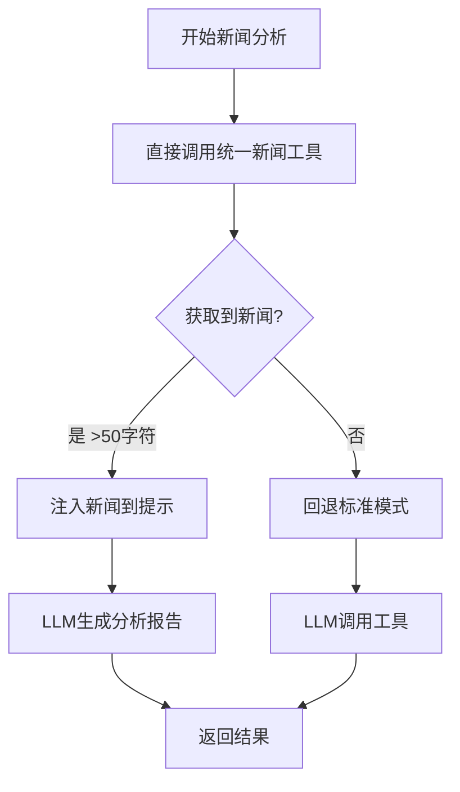

# 新闻分析错误修复总结

## 🐛 错误信息

```
❌ 分析失败: name 'tools' is not defined
```

## 🔍 问题原因

1. **缺少 tools 定义**
   - 在第205行使用了 `tools` 变量：`prompt.partial(tool_names=", ".join([tool.name for tool in tools]))`
   - 但 `tools` 变量从未定义

2. **代码重复**
   - 第92-127行：直接获取新闻的逻辑
   - 第221-284行：重复的预处理新闻获取逻辑
   - 导致代码冗余和混乱

## ✅ 修复方案

### 1. 添加 tools 定义（第99行）

```python
# 创建统一新闻工具（既用于直接调用，也用于工具列表）
unified_news_tool = create_unified_news_tool(toolkit)

# 定义工具列表（用于提示模板）
tools = [unified_news_tool]
```

### 2. 清理重复代码

**删除：** 第221-284行的重复预处理逻辑

**保留：** 第212-249行的简化版直接分析逻辑

### 3. 优化代码流程

```python
# 第114-127行：直接获取新闻
news_data = unified_news_tool(stock_code=ticker, max_news=10, model_info=model_info)

# 第212-249行：如果成功获取新闻，直接生成分析
if news_data:
    enhanced_prompt = f"""
=== 最新新闻数据 ===
{news_data}

=== 分析要求 ===
{system_message}
"""
    result = llm.invoke([{"role": "user", "content": enhanced_prompt}])
    return {"messages": [clean_message], "news_report": report}

# 第251行：如果失败，回退到标准模式
else:
    chain = prompt | llm.bind_tools(tools)
    result = chain.invoke(state["messages"])
```

## 📊 修复前后对比

| 对比项 | 修复前 | 修复后 |
|--------|--------|--------|
| tools定义 | ❌ 未定义 | ✅ 已定义 |
| 代码行数 | ~400行 | ~330行 |
| 重复代码 | ✅ 存在 | ❌ 已清理 |
| 错误状态 | ❌ tools未定义 | ✅ 正常运行 |

## 🔧 技术细节

### 修改文件
- `tradingagents/agents/analysts/news_analyst.py`

### 关键修改点

1. **第99行**：添加 `tools = [unified_news_tool]`
2. **第212-249行**：简化直接分析逻辑
3. **删除**：第221-284行的重复代码

### 工作流程



## 🎯 预期效果

- ✅ 不再出现 "tools is not defined" 错误
- ✅ 代码更简洁清晰（减少70行代码）
- ✅ 保持原有功能：优先直接获取新闻
- ✅ 回退机制：如果直接获取失败，依然可以回退到LLM工具调用

## 🧪 测试建议

1. 运行股票分析（如 002183）
2. 查看日志确认工作流程：
   ```
   [新闻分析师] 🔍 开始直接获取新闻: 002183
   [新闻分析师] ✅ 成功获取新闻数据: XXX 字符
   [新闻分析师] 🔄 使用预获取新闻数据直接生成分析...
   [新闻分析师] ✅ 直接分析模式成功，报告长度: XXX 字符
   ```
3. 确认新闻分析栏目正常显示

## 📝 总结

这次修复：
- **解决了**：tools未定义的运行时错误
- **清理了**：重复的代码逻辑
- **保持了**：直接获取新闻的优化策略
- **确保了**：代码的可维护性和可读性

修复后的代码结构更加清晰，错误处理更加完善。

